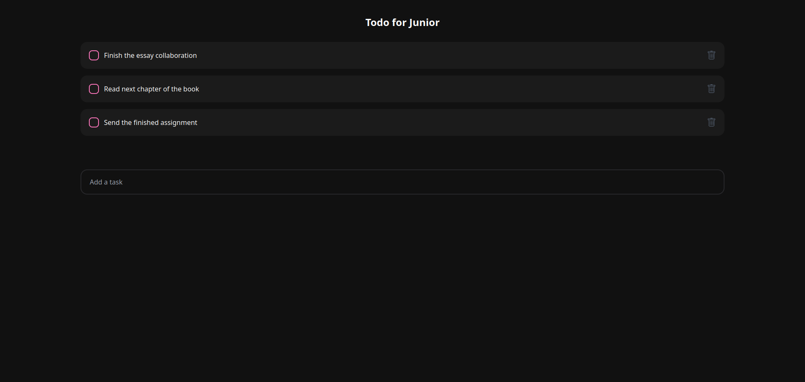

# Todo Junior - Простой список задач на React



Этот проект представляет собой веб-приложение для управления списком задач. Он создан с использованием библиотеки React и служит отличным учебным примером для начинающих разработчиков.

## Описание

Todo Junior - это простое приложение для управления списком задач. Он позволяет пользователям добавлять, удалять и отмечать задачи как выполненные. Это отличный способ научиться создавать базовое веб-приложение с использованием React.

## Особенности проекта

- Добавление новых задач.
- Удаление задач.
- Отмечание задач как выполненных.
- Визуальное отображение выполненных задач.

## Технологии

Проект был разработан с использованием следующих технологий:

- **React**: Основная библиотека для создания пользовательских интерфейсов.
- **CSS**: Для стилизации компонентов и макета приложения.
<!-- - **LocalStorage**: Для хранения задач локально в браузере пользователя. -->

## Запуск проекта

Для запуска проекта на своем компьютере выполните следующие шаги:

1. Склонируйте репозиторий на свой локальный компьютер:

   ```bash
   git clone https://github.com/your-username/todo-junior.git

2. Перейдите в директорию проекта
   ``````bash 
   cd todo-junior

3. Установите зависимости:
   ``````bash 
   npm install

4. Запустите проект:
   ``````bash 
   nmp start или yarn start

